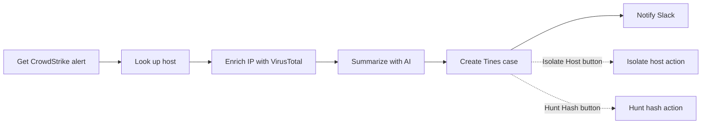

Takes a single CrowdStrike Falcon alert, enriches it, has Claude write it up as a SOC analyst would, opens a Tines case, and announces it in Slack. Built for demoing triage-to-case automation.

**Triggers.** The main chain is manual. Two HTTP routes exist as callbacks for the case-action buttons the case carries: `POST /cs-isolate-host` and `POST /cs-hunt-hash`, both authenticated with an unguessable `external_id` that Tines passes as a query parameter.

**Main chain.** Run [Get CrowdStrike alert](<Get CrowdStrike alert/README.md>) and the rest of the chain follows. There is no HTTP route and no schedule. By default it picks up the newest endpoint-protection alert with status `new`; pass `{"composite_id": "..."}` as input to target a specific one.

**The flow.**

Each step appends to a single JSON payload that accumulates `alert`, `host`, `ip_enrichment`, `case_draft`, and finally `tines_case`.

**Case actions.** Every case is created with two webhook case actions, **Isolate Host** and **Hunt Hash**, pointing back at this workflow's own routes. Each carries its own `action_id` as a query parameter, and each handler deletes its action on click so the button fires once, then writes a note: [Isolate host action](<Isolate host action/README.md>) records the host, timestamp, and who clicked; [Hunt hash action](<Hunt hash action/README.md>) enriches the alert's file hash in VirusTotal and posts the details. The route origin and the two `external_id` values are constants at the top of [Create Tines case/script.ts](<Create Tines case/script.ts>) — update them if a route or its id changes.

**External services.** CrowdStrike Falcon (alerts and devices APIs), VirusTotal (IP reputation), Anthropic (Claude, for the write-up), Tines (case and notes APIs, team **AD Case Management**), Slack (`#3b-demo`).

**Side effects.** Read-only up to and including the AI step. [Create Tines case](<Create Tines case/README.md>) opens a real case with two notes and two case actions, and [Notify Slack](<Notify Slack/README.md>) posts a real message. Cases are deduplicated by CrowdStrike `composite_id` in the `crowdstrike-cases` volume, so re-running the same alert reuses the existing case and skips the Slack post instead of opening a duplicate. Clicking a case action writes a further note and removes that action.

**Operational notes.** The alert step exits non-zero when no alert matches, which stops the run cleanly. Missing IP enrichment is tolerated and reported in the case note rather than failing. The Tines connector's `TINES_URL` is currently malformed (duplicated scheme, unresolvable `www.` prefix) and [Create Tines case/script.ts](<Create Tines case/script.ts>) works around it — worth fixing at the connector.

**Common changes.** Destination Tines team: `TEAM_ID` in [Create Tines case/script.ts](<Create Tines case/script.ts>). Slack channel: `CHANNEL` in [Notify Slack/script.ts](<Notify Slack/script.ts>). Alert selection filter or the fields carried forward: [Get CrowdStrike alert/script.ts](<Get CrowdStrike alert/script.ts>). Case wording, priority mapping, and note layout: the prompt in [Summarize with AI/script.ts](<Summarize with AI/script.ts>).
