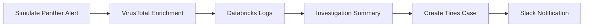

A SOC alert-enrichment pipeline that takes a Panther SIEM detection, enriches it with threat intel and related activity logs, writes up an analyst-ready investigation, opens a case, and notifies the team.

It's a linear chain, triggered manually (run [Simulate Panther Alert](<Simulate Panther Alert/script.ts>)):

**The flow**

1. **[Simulate Panther Alert](<Simulate Panther Alert/script.ts>)** — emits a sample Panther "impossible travel" detection for affected user **`sberniard`** (`sberniard@tines.io`) from a suspicious source IP.
2. **[VirusTotal Enrichment](<VirusTotal Enrichment/script.ts>)** — looks up the source IP reputation via the VirusTotal v3 API (real call).
3. **[Databricks Logs](<Databricks Logs/script.ts>)** — queries `workspace.default.tines_ocsf_silver` via the Databricks SQL Statement Execution API for the user's recent OCSF audit activity (real call).
4. **[Investigation Summary](<Investigation Summary/script.ts>)** — Claude turns the accumulated context into a markdown investigative writeup.
5. **[Create Tines Case](<Create Tines Case/script.ts>)** — creates a case via the Tines Cases API (`POST /api/v2/cases/`) and returns a browser link.
6. **[Slack Notification](<Slack Notification/script.ts>)** — posts a Block Kit message summarizing the alert with a button linking to the case.

**Connectors:** VirusTotal, Databricks, Anthropic, Tines, and Slack. Each step accumulates its enrichment onto a single JSON object passed downstream.

**Side effects:** read-only through the Databricks/VirusTotal enrichment; **read-write** at the end — it creates a Tines case and posts to Slack.

**Operational notes**
- The Tines connector's `TINES_URL` carries a `www.` prefix that doesn't resolve, so [Create Tines Case](<Create Tines Case/script.ts>) strips it.
- **Slack is not yet connected** — connect a Slack connector to the [Slack Notification](<Slack Notification/script.ts>) step before that step will succeed.
- Databricks enrichment fails soft: if the query errors, it records the error and the pipeline continues.
